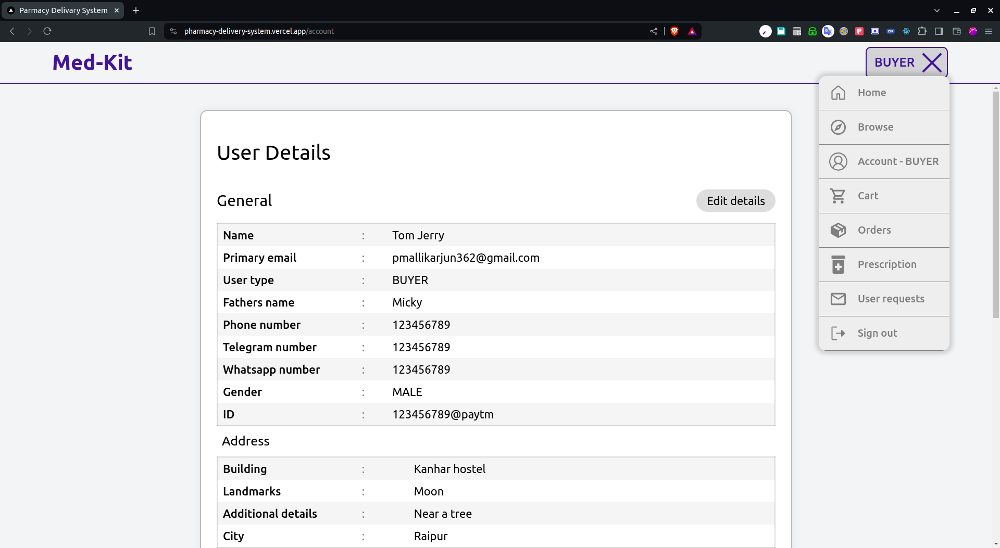

# Pharmacy delivery system 💊

|                                          |                                          |
| ---------------------------------------- | ---------------------------------------- |
|  |  |

# Features ✨

1. Role based access rights using middleware.
2. User types: General, Admin, Buyer, Seller, Dispatcher.
3. Responsive design (Desktop and Mobile specific UI).
4. Browsing and plasing orders for medicines.
5. Order timeline and unified order specific chat.
6. Gmail based JWT authentication.
7. Admin Dashboard page to view all the user users registered in the platform.

# Technologies 🛠️

1. `Next.js` : Primary Frondend and Backend Framework
1. `next-auth` : Authentication Management. Google OAuth.
1. `mongoose` : MongoDB Database ORM
1. `zod` : Advanced Form Schema Validation
1. `react-hook-form` : Form State Management.
1. `react-icons` : Icons
1. `react-spinners` : Loading Spinners
1. `jsonwebtoken` : JWT Auth related utils.
1. `axios` : Networking
1. `bcryptjs` : Cryptography utils.
1. `date-fns` : Date Time Display Formating.

# Architecture 📐

# Demo 😇

### Browsing Page

Search and place orders.
| | |
| --------------------------------------- | --------------------------------------- |
|  |  |

### Checkout Page

Checkout page displaying all the order details and prompts for prescription if some of the medicines require a prescription.
| | |
| ----------------------------------------- | ----------------------------------------- |
|  |  |

### Profile Page

Standard user profile page containing all the user information displayed in organized sections.
| | |
| ----------------------------------------- | ----------------------------------------- |
| |  |

### Orders Overview Page

Orders page displaying the orders history. Green indicating successfully delivered. Red for orders that got cancelled. Orange for orders that are yet to arrive. White for the orders that are pending for confirmation from seller side.

|                                           |                                            |
| ----------------------------------------- | ------------------------------------------ |
|  |  |
